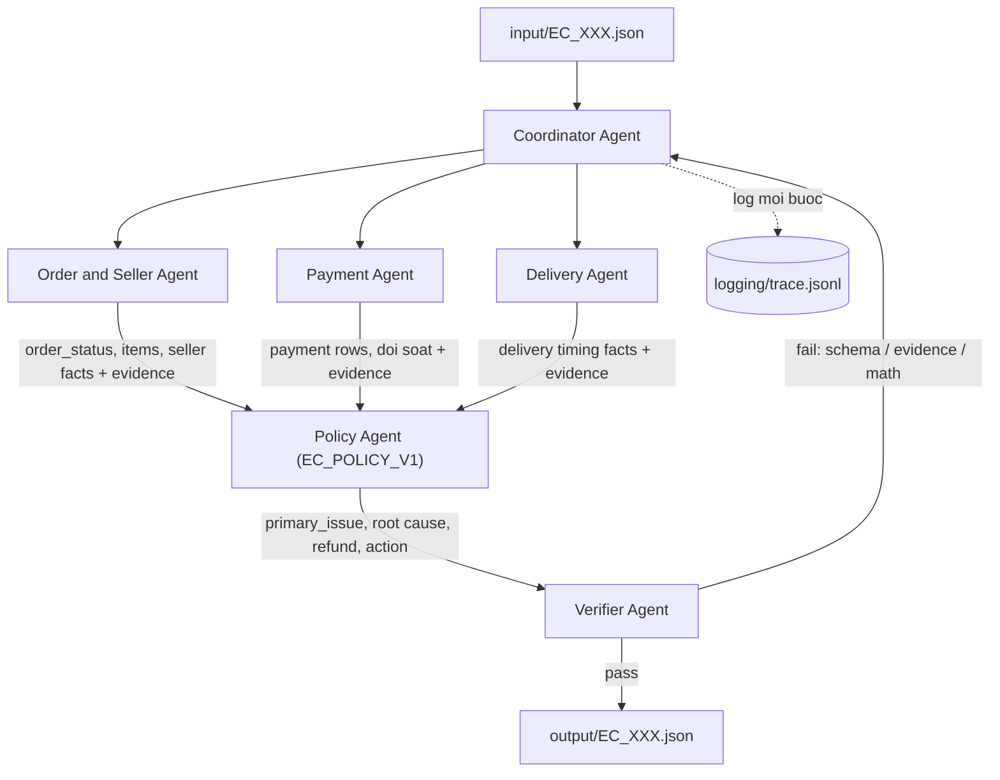
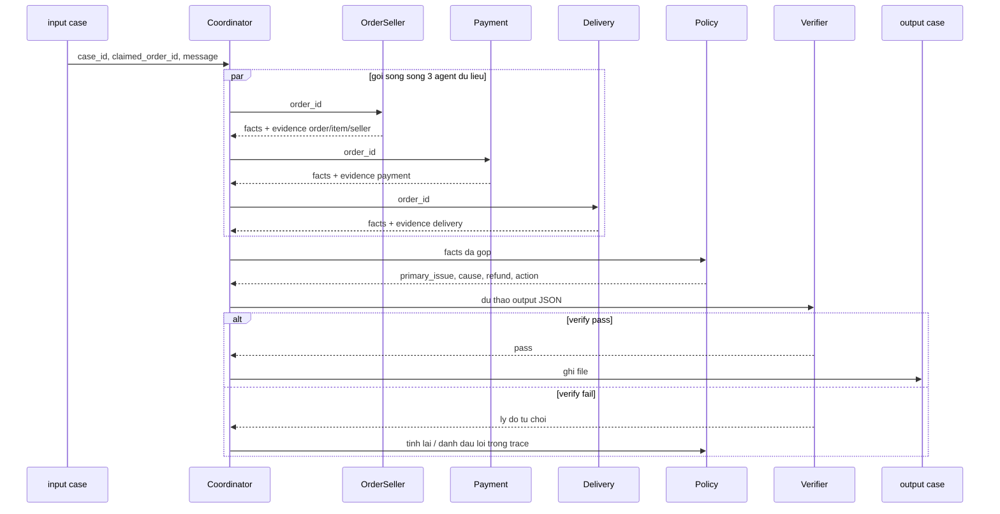

# Architecture — Multi-Agent Dispute Resolution (EC_POLICY_V1)

> Bản nháp thiết kế cho nhóm 5 người. Cập nhật lại phần còn `[ ]` khi implementation thật đi lệch khỏi bản này — file này được chấm như tài liệu mô tả hệ thống thật đã build, không phải mô tả dự định.

## 1. Nguyên lý thiết kế

README mục 7 chấm điểm dựa trên **phân công, handoff và kiểm chứng thật giữa các agent**, không chấm việc "có gọi LLM hay không" ở từng field. Toàn bộ 6 thành phần điểm số (mục 8) đều tính được 100% từ `data/*.csv` + bảng policy — không cần LLM đoán số liệu.

Vì vậy hệ thống dùng **lõi tất định (deterministic) + agent LLM mỏng**:

- **Fact, evidence ID, số tiền, primary_issue** → tính bằng code Python tất định (pandas/dict lookup + rule engine), unit-test được, không hallucinate.
- **Model ≤10B tham số** (bắt buộc — README mục 9.1) → dùng trong từng agent để viết lý do/tường thuật cho `logging/trace.jsonl`, hỗ trợ Coordinator điều phối. Text do LLM sinh ra **không bao giờ** đi thẳng vào `evidence_ids`, ID, hay số tiền trong output cuối.
- **Verifier Agent** đối chiếu mọi ID được nhắc tới với dữ liệu thật trước khi cho phép ghi file — chặn hallucination trước khi nó thành hard gate.

Model đề xuất: `llama-3.1-8b-instant` qua Groq API (nhanh, free tier, SDK tương thích OpenAI) làm chính; fallback `qwen2.5:7b-instruct` chạy local qua Ollama khi mất mạng/hết quota. **[ ]** Điền tên model thật đã dùng vào đây và vào `logging/metadata.json` trước khi nộp.

## 2. Vai trò agent

| Agent | Sở hữu (repo) | Input | Output → handoff cho |
| --- | --- | --- | --- |
| Coordinator | `src/agents/coordinator.py` | `input/EC_XXX.json` | Điều phối 3 agent dữ liệu → Policy → Verifier → `output/EC_XXX.json` |
| Order & Seller | `src/agents/order_seller_agent.py` | `claimed_order_id` | order_status, items, seller vi phạm handoff + evidence → Coordinator |
| Payment | `src/agents/payment_agent.py` | `order_id`, item/freight total | payment rows, đối soát + evidence → Coordinator |
| Delivery | `src/agents/delivery_agent.py` | `order_id` | đúng/trễ hạn giao + evidence → Coordinator |
| Policy (`EC_POLICY_V1`) | `src/agents/policy_agent.py` | facts đã gộp từ 3 agent trên | primary_issue, root cause, refund, action → Coordinator |
| Verifier | `src/agents/verifier_agent.py` | JSON nháp từ Coordinator | pass / fail + lý do → Coordinator |

**Quyền truy cập dữ liệu:** chỉ Order&Seller, Payment, Delivery được đọc trực tiếp CSV (qua `src/data_access.py` dùng chung, load 1 lần khi khởi động). Policy và Verifier chỉ nhận facts đã có evidence ID kèm theo — không tự ý mở CSV để "tra thêm" ngoài evidence đã được agent nguồn cấp, tránh evidence không truy vết được nguồn handoff.

## 3. Luồng xử lý 1 case



## 4. Handoff message (A2A)

Mỗi agent dữ liệu trả cho Coordinator một message tối thiểu gồm: `case_id`, `from_agent`, `facts` (kèm evidence ID cho từng fact), `missing_or_conflicting`, `suggested_next`. Ví dụ:

```json
{
  "case_id": "EC_001",
  "from_agent": "order_seller_agent",
  "facts": { "order_status": "delivered", "items": [ ] },
  "evidence_ids": ["order:<order_id>", "item:<order_id>:1"],
  "missing_or_conflicting": [],
  "suggested_next": "policy_agent"
}
```

Mỗi bước handoff (kể cả Policy và Verifier) được `src/tracing.py` append 1 dòng vào `logging/trace.jsonl` — đây là trace kiểm tra được theo yêu cầu README mục 8.



## 5. Bảng EC_POLICY_V1 (thứ tự ưu tiên — rule đầu tiên khớp thắng)

| # | primary_issue | Điều kiện | Trách nhiệm | Refund | Action | cause_code |
| - | --- | --- | --- | --- | --- | --- |
| 1 | `canceled_order_paid` | order_status = canceled & tổng payment > 0 | platform / OLIST_PLATFORM | tổng payment | `issue_full_refund` | `ORDER_CANCELED_AFTER_PAYMENT` |
| 2 | `unavailable_order_paid` | order_status = unavailable & tổng payment > 0 | platform / OLIST_PLATFORM | tổng payment | `issue_full_refund` | `ORDER_UNAVAILABLE_AFTER_PAYMENT` |
| 3 | `late_delivery_seller` | giao sau estimated date & carrier nhận sau shipping_limit_date | seller / seller_id vi phạm | tổng freight | `refund_freight` | `SELLER_HANDOFF_AFTER_LIMIT` |
| 4 | `late_delivery_logistics` | giao sau estimated date & carrier nhận không muộn hơn shipping_limit_date | logistics_provider / LOGISTICS_PROVIDER | tổng freight | `refund_freight` | `CARRIER_DELIVERED_AFTER_ESTIMATE` |
| 5 | `valid_split_payment` | ≥2 payment row; tổng payment khớp tổng item+freight (sai số 0.10 BRL) | không có | 0 | `explain_valid_split_payment` | `MULTIPLE_PAYMENTS_RECONCILED` |
| 6 | `unsupported_late_claim` | giao không muộn hơn estimated date & payment khớp | không có | 0 | `reject_late_refund` | `DELIVERY_WITHIN_ESTIMATE` |

Evidence ID hợp lệ — đúng 5 dạng: `order:<order_id>`, `item:<order_id>:<order_item_id>`, `payment:<order_id>:<payment_sequential>`, `seller:<seller_id>`, `policy:<root_cause_code>`. Giới hạn output: ≤5 id/entity set, ≤10 evidence, ≤3 root cause, ≤3 responsible party, ≤5 action, `confidence` ∈ [0, 1].

## 6. Quyết định kỹ thuật cần chốt (điền khi nhóm quyết định)

- **Dung sai rule 6 (`unsupported_late_claim`):** README chỉ nêu rõ sai số 0.10 BRL ở rule 5. Role 2 đề xuất dùng lại `0.10 BRL` qua `UNSUPPORTED_CLAIM_TOLERANCE_BRL` để giữ cùng định nghĩa "payment khớp" giữa Payment Agent và Policy Agent. **Pending Role 4 confirmation** trước khi coi đây là quyết định cuối.
- **Làm tròn tiền dùng chung:** **[ ]** `Decimal` + `ROUND_HALF_UP` hay cách khác — áp dụng nhất quán giữa Payment Agent và Policy Agent.
- **Case không khớp rule nào (nếu phát sinh khi chạy 50 case thật):** **[ ]** fallback là gì, confidence bao nhiêu, có cần review tay không.
- **Xử lý ngày rỗng (NaT):** Delivery/Policy Agent luôn kiểm `notna()` trước khi so sánh `order_delivered_customer_date`/`order_delivered_carrier_date` — không suy ra "đúng hạn" từ giá trị rỗng.

## 7. Rủi ro hard-gate cần verifier chặn trước khi ghi file

- JSON không parse được / sai tên file so với input.
- Thiếu field hoặc sai kiểu so với schema (README mục 6).
- `evidence_id` trỏ tới order/item/payment/seller không tồn tại trong `data/`.
- `evidence_id` sai định dạng (không đi qua hàm build chung).
- `confidence` ngoài [0, 1]; vượt giới hạn số lượng entity/evidence/cause/party/action.
- Thiếu file trong `output/` (phải luôn đủ 50) — Coordinator bọc try/except, lỗi vẫn ghi 1 JSON hợp lệ với confidence thấp thay vì bỏ trống.

## 8. Đóng gói & nộp bài

- Repo git giữ nguyên tên, commit đủ source code + `output/` (50 file) + `architecture.md` + báo cáo cá nhân từng người + `logging/trace.jsonl` + `logging/metadata.json`.
- File zip nộp qua form **chỉ chứa `output/`** (README mục 8–9) — không kèm source code, `.env`, hay file audit.
